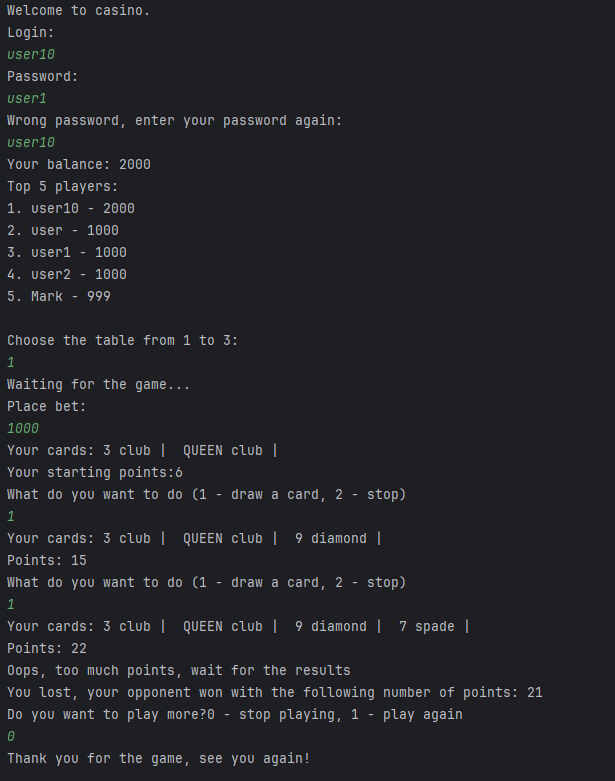
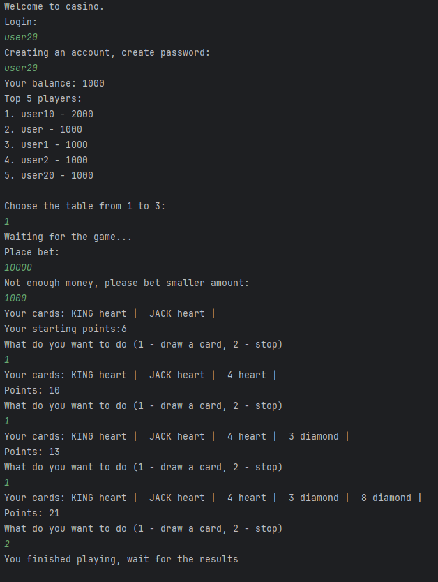
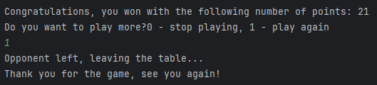
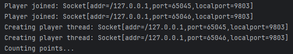

# Multiplayer Blackjack

Multiplayer Blackjack game built in Java and MySQL.

## Description

This application is a game of blackjack, played by two players "sitting" at one table. If two players are logged in and are sitting at the same table, after placing a bet, a round begins, players are given cards and can draw next cards. The round lasts until one of the players stops drawing cards or folds. Wins the player that has more points, but at the same time has less points than 21. After the round ends, players can play next round if both of them agree.

## Technologies

This game is built in Java using sockets, to connect a player to game server and to allow communication between them, and multithreading to allow parallel code execution, better usage of resources and so that one player can make moves in the game without having to wait for the other player.
Application also use JDBC MySQL Connector used to connect the application to the database in which tables store login, password and player account balance.

## Setup

To set up the game, follow these steps:

1. Clone this repository to your local machine using: `git clone https://github.com/lukiiis/multiplayer_blackjack.git`
2. Open project in your IDE
3. Launch Casino.java and User.java file in your IDE

## Built with

* Java
* MySQL

## Screenshots

Gameplay example:

### User 1

### User 2

### Server

## Authors

- [Łukasz Czyszczoń](https://github.com/lukiiis)

- [Krzysztof Cybulski](https://github.com/zysio)

## License

This project is licensed under the GNU General Public License

